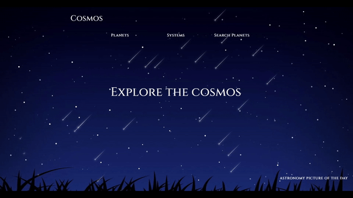
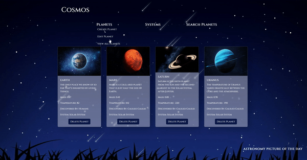
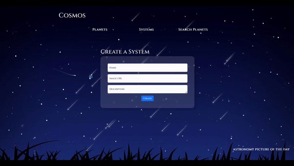
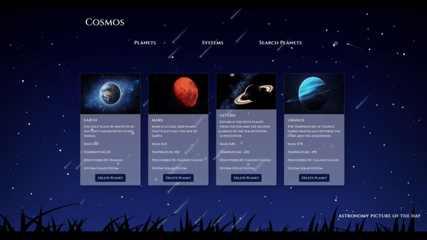
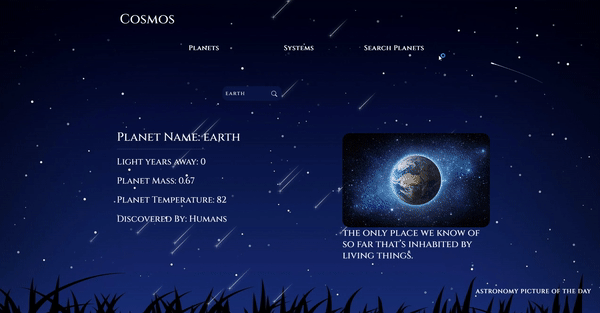
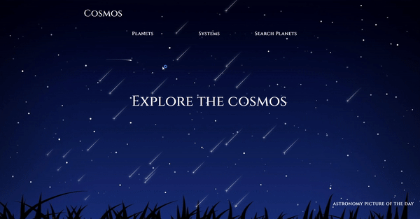
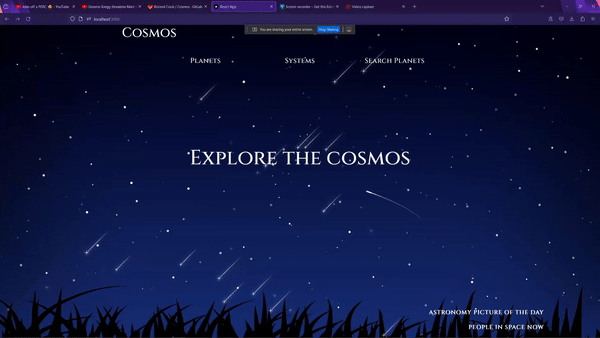
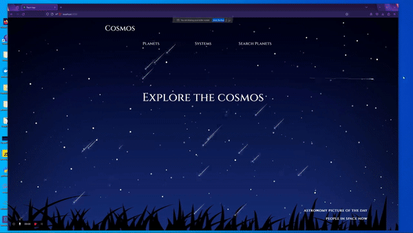

# Comos

## Getting started

Cosmos was created using Django for the backend and react for the front end. This application is fully containerized using Docker. To run the application please utilize our docker compose file. While in your terminal navigate to this project and in the parent directory please run the command "docker compose build" followed by "docker compose up". 

## Application Details

This application was built to model planets, planetary systems and the overall navigation of celestial bodies. 

Cosmos was created utilizing CRUD methodologies while making various API calls. I used three third party APIs in the creation of this application. 

- Nasa's API to grab the picture of the day along with its description
- Ninjas Planet API to make it possible to search through thousands of planets and pull information about the planet.
- People in Space API to see all the people that are currently in space.

When using this application please note that you cannot have two planets with the same name. Also when searching for planets using Ninjas search you will notice that the planet image is static, that is because Ninjas API does not contain imagery for its planets.

I've built several features to encourage the original image I had in mind when creating this application. Please see examples down below. 

***

# CRUD

<h3> Users can define planets by filling out the form, users must first define a planetary system to properly complete this form. </h3>

<h3> Once a planet is defined users can then view a list of all planets defined. </h3>

<h3> Users can also define planetary systems within this application, these systems are tied to planets using foreign keys. </h3>

<h3> Under search planets users have the ability to search through any planets they defined within the application to that planets particular information. </h3>

## Third Party APIs

<h3> Using Ninjas Planet API users can search through thousands of planets and pull the information of that planet . </h3>

<h3> On the bottom right users can access Nasa's Astronomy Picture of The Day. And they can also see the people currently in space according to the people in space API. </h3>

## Mobile Responsiveness

## Technologies 
HTML, CSS, JS, Python, React, Django, SASS, Bootstrap

## Project status
Completed responsiveness on all device sizes. Thinking of adding another section to the application to also view discovered stars.
